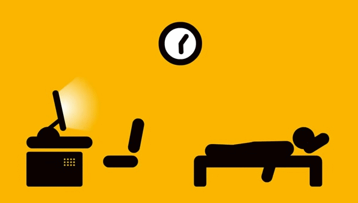

### Hi there 👋 I am [Gomathi](https://www.gomathi.me)
*Web developer|Quick learner|Motivational Speaker* <a href="https://dev.to/gomathiaravindan">
  
 

      
  

 

- 🔭 I’m currently persuing B.Tech IT 3rd year in *Government College of Technology*.
- 🌱 I’m currently learning Full Stack (Django + Bootstrap)
- 👯 I’m looking to do projects on Full Stack and Python programming language
- 📫 How to reach me: [Gomathi Aravindan](https://www.linkedin.com/in/gomathi2000)(Linkedin)
- :smile:Portfolio: www.gomathi.me
- 😄 Pronouns: her
- ⚡ Fact: "Knowledge, Kindness and Selfmotivation are the key to success"

## About me:
  Energetic and Passionate learner. Enthusiastic and clear minded in solving problems.
  Sincere and with positive attitude.
  Exploring to new teachnologies to develop skills.
  Interested in coding and trying out different projects.
  Self motivator and make use of my mistakes to learn more.
 Daily I spent more than 10 hours to develop myself. 

 

 

        

## Languages Known:

## Project:

Front-end(HTML,CSS,Javascript,Bootstrap): [ArtGallery](https://sketchesgallery.netlify.app/)
